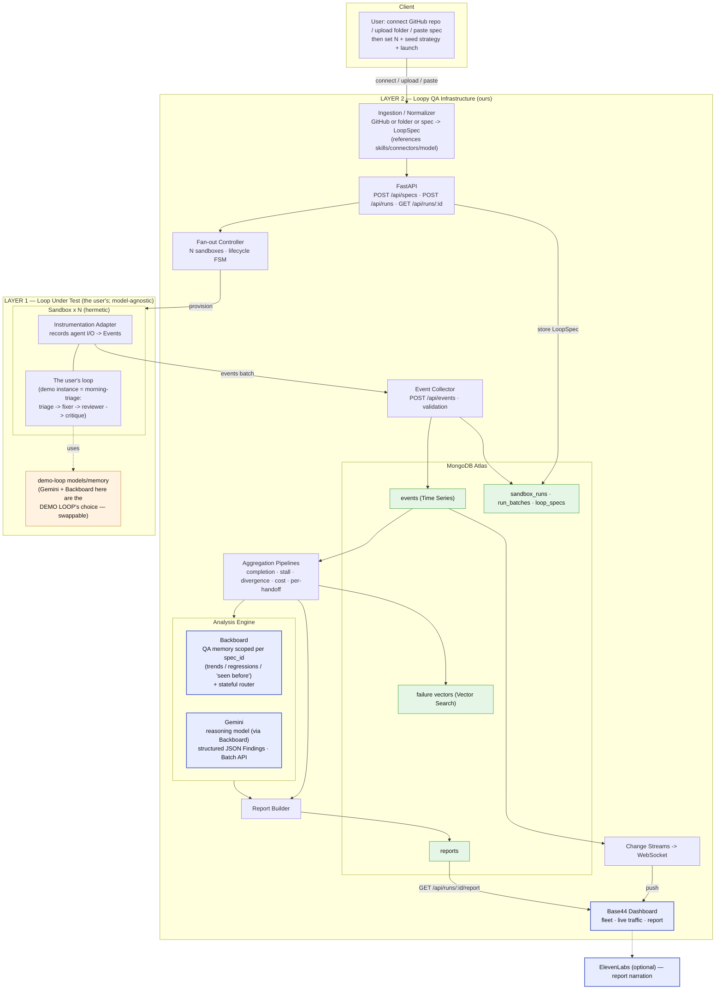

# Architecture Flow — Loopy

Precedence reminder: if anything here conflicts with `SHARED_CONTRACTS.md`, the contracts win.

## The two-layer model (read this first)

Loopy has two clearly separated layers. Keeping them separate resolves "whose model is it?" and "where do sponsors belong?".

- **Layer 1 — the Loop Under Test (the user's).** Its models, prompts, skills, and connectors are whatever the *user* chose. Loopy is **model-agnostic** here — if their loop runs on GPT-5, Claude, or Gemini, we test it as-is. We do **not** impose our stack on it. Loopy runs the loop in a sandbox behind an **instrumentation adapter** that records agent I/O regardless of the underlying model.
  - *For the demo,* the Layer-1 loop is our authored **morning-triage** loop, which happens to use Gemini agents + Backboard memory — but that's the demo loop's choice, not a Loopy requirement.
- **Layer 2 — Loopy's QA Infrastructure (ours).** This is our stack, and where the sponsors legitimately live: **MongoDB** (event store + stats + clustering), **Gemini** (the analysis model that narrates findings), **Backboard** (longitudinal QA memory + analysis routing), **Base44** (dashboard). Optional: ElevenLabs (narration).

> One line: **Layer 1 is the user's loop we observe; Layer 2 is the QA product we built. Sponsors power Layer 2.**

## High-Level Flow

```
[User] --register loop (GitHub / folder / spec)--> [Loopy API]
   -> normalize to LoopSpec (references the user's skills/connectors/model; we don't re-model them)
   -> POST /api/runs (N, seed strategy)
   -> Fan-out Controller provisions N sandboxes
        each sandbox: [instrumentation adapter] wraps [the Loop Under Test] -> emits Events
   -> Collector -> MongoDB (events time-series, sandbox_runs)
   -> live: Change Streams -> WebSocket -> Dashboard
   -> on completion: Mongo aggregation (stats) + vector clustering
        -> Analysis Engine: Backboard-routed Gemini agent (with per-spec QA memory) -> Findings
   -> Report -> MongoDB reports -> Dashboard
```

## Full Tech Architecture (Mermaid)

Coloured nodes are third-party platforms. Note the split: platforms inside **Layer 1** belong to the *demo loop* (swappable); platforms inside **Layer 2** are *Loopy's* infrastructure.



### Where each platform comes into play
| Platform | Layer | Where it plugs in | Why here |
|---|---|---|---|
| **MongoDB Atlas** | 2 (Loopy) | event store + stats + clustering | Time-series events; change-streams live feed; vector-search within-batch clustering |
| **Gemini** | 2 (Loopy) | analysis model that writes `Finding`s | Structured JSON output, Batch API for the analysis pass; served **via Backboard** |
| **Backboard** | 2 (Loopy) | longitudinal QA memory + analysis routing | Memory scoped per `spec_id` = trends/regressions across batches; router serves the analysis model |
| **Base44** | 2 (Loopy) | dashboard / report viewer | Front-end; Mongo stays source of truth |
| **ElevenLabs** | 2 (opt) | report narration | Voice summary |
| **Gemini / Backboard (again)** | **1 (demo loop)** | the morning-triage agents' model + memory | *The demo loop's* choice — swappable; NOT required of a user's loop |

## Loop ingestion (how a loop gets registered)

Tiered, because auto-parsing an arbitrary loop repo is hard:
1. **GitHub connect / folder upload** — for a *known* layout (e.g. a Claude Code `.claude/` skills + agents structure), the Normalizer maps it to a `LoopSpec` automatically.
2. **Spec paste (JSON)** — universal fallback; always works.

The `LoopSpec` **references** the user's skills/connectors/models rather than re-modeling them (decided). Loopy needs only enough to run + observe the loop, not to re-implement it.

### Proposed `SHARED_CONTRACTS` deltas (fold in at contract-lock)
```python
class LoopSpec(BaseModel):
    spec_id: str
    name: str
    source: dict            # NEW: {kind: "github"|"folder"|"inline", ref: "...", detected_framework: "..."}
    agents: list[AgentDef]
    topology: list[dict]
    termination: dict
    skills: list[dict] = []       # NEW: references to skill files (path/name), not their contents
    connectors: list[dict] = []   # NEW: MCP/tool/connector references the loop needs
    created_at: datetime

# AgentDef.model stays whatever the USER's loop uses (model-agnostic) — Loopy does not override it.

class QaMemory(BaseModel):        # NEW (Layer-2, Backboard-backed): longitudinal memory per loop
    spec_id: str                  # the entity memory is scoped to
    last_run_id: str | None
    known_findings: list[dict]    # so we tag "recurring" vs "new" and compute regressions
    trend: dict                   # e.g. {"nod_rate": [0.09, 0.06, 0.04]}
```

## Components

### 1. Loop Spec Ingestion (Layer 2)
- Input: a GitHub repo, an uploaded folder, or a pasted spec.
- Normalizer produces a `LoopSpec` that **references** the loop's agents, skills, connectors, and models.

### 2. Fan-out Controller (Layer 2)
- Provisions N sandboxes, assigns `run_id` + `sandbox_id`, tracks lifecycle:
  `pending → provisioning → running → completed | failed | stalled | timed_out`.

### 3. Sandboxes + Instrumentation Adapter (Layer 1 execution, Layer 2 capture)
- Substrate: asyncio isolation for MVP; runner is substrate-agnostic.
- The **adapter** wraps the loop and records agent I/O (agent messages, tool calls, iterations, state updates, terminations) as `Event`s — **independent of the loop's model**. For the demo we instrument our morning-triage loop directly; the general path is an SDK/LLM-proxy adapter.

### 4. Event Capture (Layer 2)
- Collector validates each `Event` and writes to the `events` **time-series** collection; updates `sandbox_runs`.

### 5. Analysis (Layer 2)
- **Deterministic first (Mongo):** aggregation pipelines compute completion rate, stall detection, iteration histogram, cost/divergence, per-handoff rates. Python does the sequence/oracle logic (stall signature, identical-seed divergence, answer-key checks).
- **Clustering:** Atlas Vector Search groups this batch's failures.
- **Analysis Engine (Backboard + Gemini):** a Backboard-routed Gemini agent narrates clusters into `Finding`s, using **per-`spec_id` QA memory** to tag recurring vs new and compute regressions/trends vs prior batches. Math decides; the LLM narrates.

### 6. Reporting & Dashboard (Layer 2)
- Report = findings + stats + representative transcripts + **trend vs last run**, stored in `reports`.
- Dashboard: fleet status (live via change streams), sampled traffic feed, report view. Optional ElevenLabs narration.

## Failure Handling Principles
- A sandbox failure is DATA, not an error: record + classify it.
- Only infra failures (provisioning errors) retry; loop-behavior failures never do — they're the product.
- Every event carries `run_id` + `sandbox_id` + `seq`.

## Decisions Log
| # | Decision | Chosen | Why |
|---|---|---|---|
| 1 | Sandbox substrate | asyncio (MVP) | build runner substrate-agnostic; don't block |
| 2 | Event capture | push | simpler collector |
| 3 | Events storage | time-series | ~90% compression, range queries at scale |
| 4 | Live feed | change streams → WS | real-time, resumable |
| 5 | **Layers** | **Layer 1 loop-under-test (model-agnostic) vs Layer 2 Loopy infra** | sponsors belong to Layer 2; don't impose our stack on the user's loop |
| 6 | **LoopSpec** | **reference skills/connectors/model, don't re-model** | Loopy needs to run+observe, not re-implement |
| 7 | **Backboard role** | **longitudinal QA memory per spec + analysis router** | makes Loopy stateful across runs (trends/regressions); serves Gemini |
| 8 | Ingestion | GitHub/folder for known layouts + spec paste fallback | auto-parsing any repo is hard |
